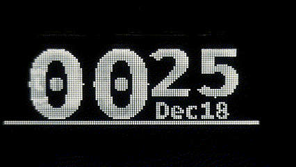
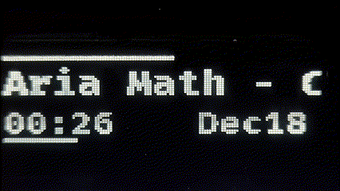
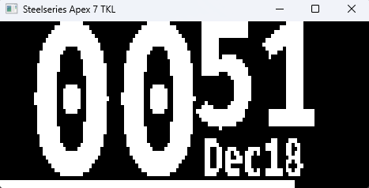

# OmniLED

OmniLED is a program allowing you to control devices with an OLED screen. It's designed to work on both Linux and
Windows, while supporting all SteelSeries devices, virtually any custom USB device, and allowing for in-depth
customization.







## Features

- Customizability with the Lua scripting engine:
  - Create custom layouts
  - Write event handlers
  - Use any font
- Built-in applications:
  - Input and output audio device information via [audio](omni-led-applications/audio/README.md)
  - Date and time via [clock](omni-led-applications/clock/README.md)
  - Load images into OmniLED via [images](omni-led-applications/images/README.md)
  - Currently playing media information via [media](omni-led-applications/media/README.md)
  - Weather via [weather](omni-led-applications/weather/README.md)
- Extensibility:
  - Create custom applications using the [gRPC interface](omni-led-api/proto/plugin.proto)
  - Configure the usb settings and data format to work with your device
- Versatility:
  - Works on Linux and Windows
  - Choose from multiple backends: Raw USB, Emulator, SteelSeries GG

## Supported Devices

OmniLED can be customized to support virtually any USB device, but it comes with some configurations that should work
right out of the box.

### USB

Devices confirmed to be working:

- SteelSeries Apex 5
- SteelSeries Apex 7 TKL
- SteelSeries Apex Pro
- SteelSeries Apex Pro TKL Wireless Gen 3

> You can help expand this list by submitting a PR with a tested configuration. See
> the [contributing guide](CONTRIBUTING.md) for more information.

### SteelSeries GG

If SteelSeries GG supports your device, then OmniLED will support it too via the SteelSeries GG backend. All you need to
know is its screen size.

### Emulator

Emulator will render a window on your screen. Useful to test the application or new layouts without affecting your
physical device.

## Quick start guide

Install OmniLED (see the [installation steps](docs/install.md) for both Linux and Windows) and run it.

> At this point you should see an emulator window using a default config.

Now you can proceed to actually make OmniLED send data to your device.

1. Navigate to the `<CONFIG_DIR>` inside the installation directory. This will by default be:
    - Windows: `C:\Users\<username>\AppData\Roaming\OmniLED\config`
    - Linux: `~/.config/OmniLED/config`
2. Open [`<CONFIG_DIR>/devices.lua`](config/devices.lua) to see if your device is already listed.  
   If it is, skip to step 4.
3. Create a new configuration file for your device.
   > You can use [`<CONFIG_DIR>/devices.lua`](config/devices.lua) as examples.
4. Update the `<CONFIG_DIR>/scripts.lua` to register the scripts for your device instead of the emulator.

    ```diff
    SCREEN_BUILDER
    -   :new('Emulator')
    +   :new('YOUR_DEVICE_NAME')
        :with_layout_group({
            {
                layout = volume,
                run_on = { 'AUDIO.Input', 'AUDIO.Output' },
            },
            {
                layout = spotify,
                run_on = { 'SPOTIFY.Artist', 'SPOTIFY.Progress', 'SPOTIFY.Title' },
            },
            {
                layout = clock,
                run_on = { 'CLOCK.Seconds' },
            },
        })
        :with_layout_group({
            {
                layout = weather,
                run_on = { 'CLOCK.Seconds' },
            }
        })
        :with_layout_group_toggle({ 'KEY(RAlt)', 'KEY(Slash)' })
        :register()
    ```

5. Run the application again. You should now see the data on your device's screen.
6. Now you can customize the layout to your liking or keep it as is.

## Troubleshooting

If the application doesn't start or crashes, check the logs and see if this helps you resolve the problem.
If this doesn't help, feel free to [open an issue](https://github.com/llMBQll/OmniLED/issues/new).

You can find the logs in your systems' `config` directory. By default, this will be:

- Windows: `C:\Users\<username>\AppData\Roaming\OmniLED\data\logging.log`
- Linux: `~/.config/OmniLED/data/logging.log`

## Contributing

All contributions are welcome! See the [contributing guide](CONTRIBUTING.md) for more information.

## Roadmap

- [x] GIF support
- [x] Loading custom images (Load images and GIFs from disk)
- [ ] Hardware info (CPU usage, temps, RAM usage, etc.)
- [ ] Discord info (Mic status, currently speaking user, etc.)
- [ ] Graphical interface for installer and settings

## License

This project is licensed under the GNU General Public License v3.0, see the [LICENSE](LICENSE) file for details.
