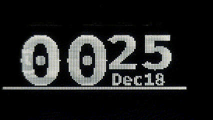
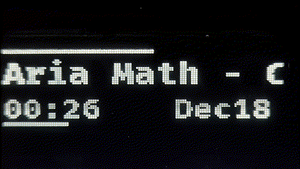
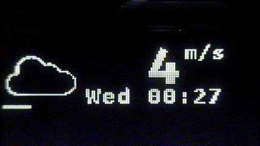
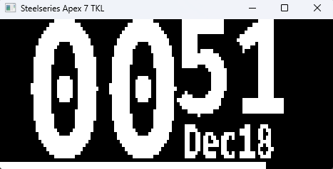

# OmniLED

OmniLED is a program allowing you to control devices with an OLED screen. It's designed to work
on both Linux and Windows, while supporting virtually any USB device and allowing for in depth
customization.

## Features

- Show relevant data via the built-in applications. OmniLED provides:
    - Time and date,
    - Information about currently playing media,
    - Audio devices' volume,
    - Current weather
- Customization. Set what happens on the screen, where it happens and how it happens. Enabled by
  Lua scripting that allows control over your devices.
- Extensibility.
    - OmniLED provides a gRPC interface that can be implemented to provide extra data.
    - Support is ready for many different USB devices, thanks to comprehensive USB device
      configuration, and ability to transform rendered data to any format.

## Installation

See the [installation steps](docs/install.md) for both Linux and Windows.

## Customization

OmniLED provides extensive customization options, see all the details
described [here](docs/customization.md).

## Roadmap

- [ ] GIF support
- [ ] Loading custom images (Load images and GIFs from disk)
- [ ] Getting events from discord (Mic status, currently speaking user etc.)
- [ ] Graphical interface for installer and settings