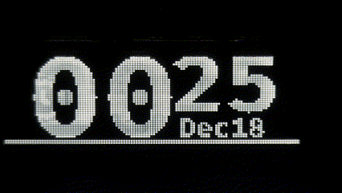
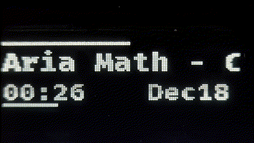
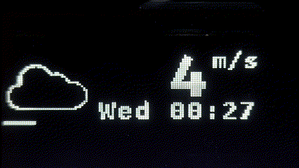
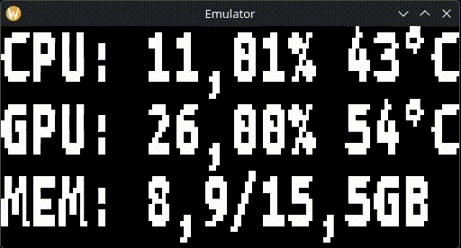

# OmniLED

Control OLED screen on SteelSeries and other devices. Works on macOS, Windows, and Linux.
Lua scripting engine and plugin system enable in-depth customization, to make the device truly yours.

## Example layouts on device and in emulator







## Features

- Customizability with the Lua scripting engine:
  - Create custom layouts
  - Write event handlers
  - Use any font
- Built-in applications:
  - Input and output audio device information via [audio](omni-led-applications/audio/README.md)
  - Date and time via [clock](omni-led-applications/clock/README.md)
  - Load images into OmniLED via [images](omni-led-applications/images/README.md)
  - Currently playing media information via [media](omni-led-applications/media/README.md)
  - System resource usage and temperatures via [system](omni-led-applications/system/README.md)
  - Weather via [weather](omni-led-applications/weather/README.md)
- Extensibility:
  - Create custom applications using the [plugin interface](omni-led-api/omni_led_api.h)
  - Configure the usb settings and data format to work with your device
- Versatility:
  - Works on macOS, Windows and Linux
  - Choose from multiple backends: Raw USB, Emulator, SteelSeries GG

## Supported Devices

OmniLED can be customized to support virtually any USB device, but it comes with some configurations that should work
right out of the box.

### USB

Officially supported devices:

- SteelSeries Apex 5
- SteelSeries Apex 7 TKL
- SteelSeries Apex Pro
- SteelSeries Apex Pro TKL Wireless Gen 3 (Wired mode)
- SteelSeries Apex Pro TKL Wireless Gen 3 (2.4G Wireless mode)

> You can help expand this list by submitting a PR with a tested configuration. See
> the [contributing guide](CONTRIBUTING.md) for more information.

### SteelSeries GG

If SteelSeries GG supports your device, then OmniLED will support it too via the SteelSeries GG backend. All you need to
know is its screen size.

### Emulator

Emulator will render a window on your screen. Useful to test the application or new layouts without affecting your
physical device.

## Quick start guide

Install OmniLED (see the [installation steps](docs/install.md) for both Linux and Windows) and run it.

> At this point you should see an emulator window using a default config.

Now you can proceed to actually make OmniLED send data to your device.

1. Navigate to the `<CONFIG_DIR>` inside the installation directory. This will by default be:
    - macOS: `/Users/<username>/Library/Application Support/OmniLED/config`
    - Linux: `/home/<username>/.config/OmniLED/config`
    - Windows: `C:\Users\<username>\AppData\Roaming\OmniLED\config`
2. Open [`<CONFIG_DIR>/devices.lua`](config/devices.lua) to see if your device is already listed.  
   If it is, skip to step 4.
3. Create a new configuration file for your device.
   > You can use [`<CONFIG_DIR>/devices.lua`](config/devices.lua) as examples.
4. Update the `<CONFIG_DIR>/scripts.lua` to register the scripts for your device instead of the emulator.

    ```diff
    SCREEN_BUILDER
    -   :new('Emulator')
    +   :new('YOUR_DEVICE_NAME')
        :with_layout_group({
            {
                layout = volume,
                run_on = { 'AUDIO.Input', 'AUDIO.Output' },
            },
            {
                layout = spotify,
                run_on = { 'SPOTIFY.Artist', 'SPOTIFY.Progress', 'SPOTIFY.Title' },
            },
            {
                layout = clock,
                run_on = { 'CLOCK.Seconds' },
            },
        })
        :with_layout_group({
            {
                layout = weather,
                run_on = { 'CLOCK.Seconds' },
            }
        })
        :with_layout_group_toggle({ 'KEY(RAlt)', 'KEY(Slash)' })
        :register()
    ```

5. Select 'Reload scripts' entry from the tray icon menu or restart the application.
   You should now see the data on your device's screen.
6. Now you can customize the layout to your liking or keep it as is.

## Troubleshooting

If the application doesn't start or crashes, check the logs and see if this helps you resolve the problem.
If this doesn't help, feel free to [open an issue](https://github.com/llMBQll/OmniLED/issues/new).

You can find the logs in your systems' `config` directory. By default, this will be:

- macOS: `/Users/<username>/Library/Application Support/OmniLED/data/logging.log`
- Linux: `/home/<username>/.config/OmniLED/data/logging.log`
- Windows: `C:\Users\<username>\AppData\Roaming\OmniLED\data\logging.log`

### macOS installation note

Because the OmniLED executable is currently unsigned, macOS may block it from running and display the following warning:
> **"OmniLED" is damaged and can't be opened. You should move it to the Trash.**

Most of the, this actually doesn't mean it's damaged. You just need to grant macOS permission to trust it, using one of
the solutions below:

#### Method 1: Via System Settings

You can whitelist the app by navigating to **System Settings > Privacy & Security** and clicking **Open Anyway**.  
For detailed steps, see Apple's official guide:
[Open a Mac app from an unknown developer](https://support.apple.com/en-gb/guide/mac-help/mh40616/mac).

#### Method 2: Via Terminal

Alternatively, you can manually strip the macOS quarantine flag by opening a Terminal and running the following command:

```shell
xattr -dr com.apple.quarantine /Applications/OmniLED.app
```

## Contributing

All contributions are welcome! See the [contributing guide](CONTRIBUTING.md) for more information.

## Roadmap

- [x] GIF support
- [x] Loading custom images (Load images and GIFs from disk)
- [x] Hardware info (CPU usage, temps, RAM usage, etc.)
- [ ] Discord info (Mic status, currently speaking user, etc.)
- [ ] Graphical interface for settings

## License

This project is licensed under the GNU General Public License v3.0, see the [LICENSE](LICENSE) file for details.
